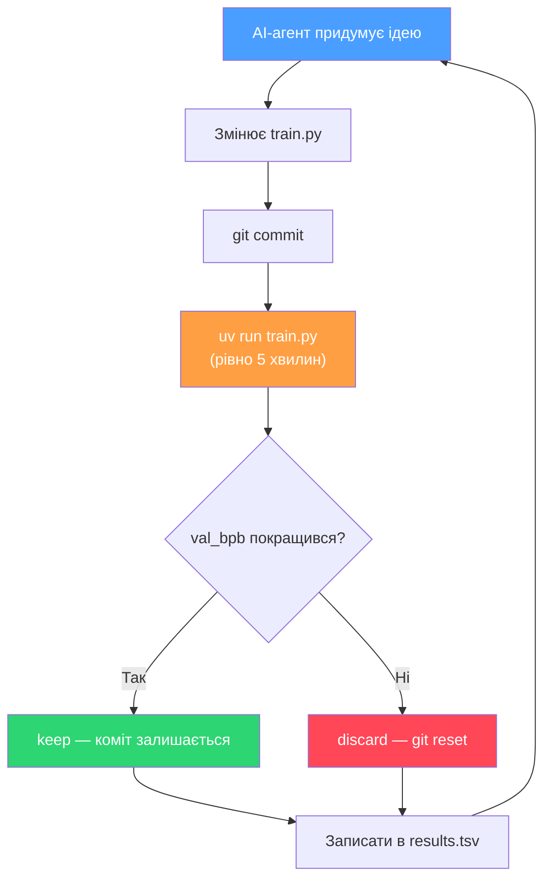
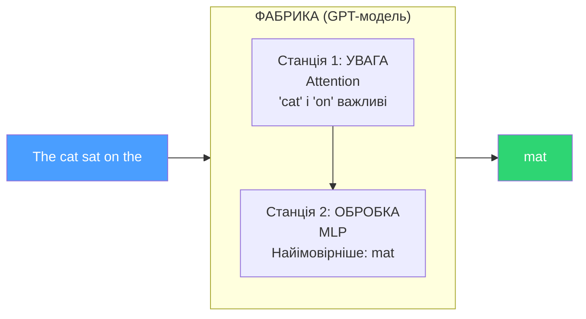
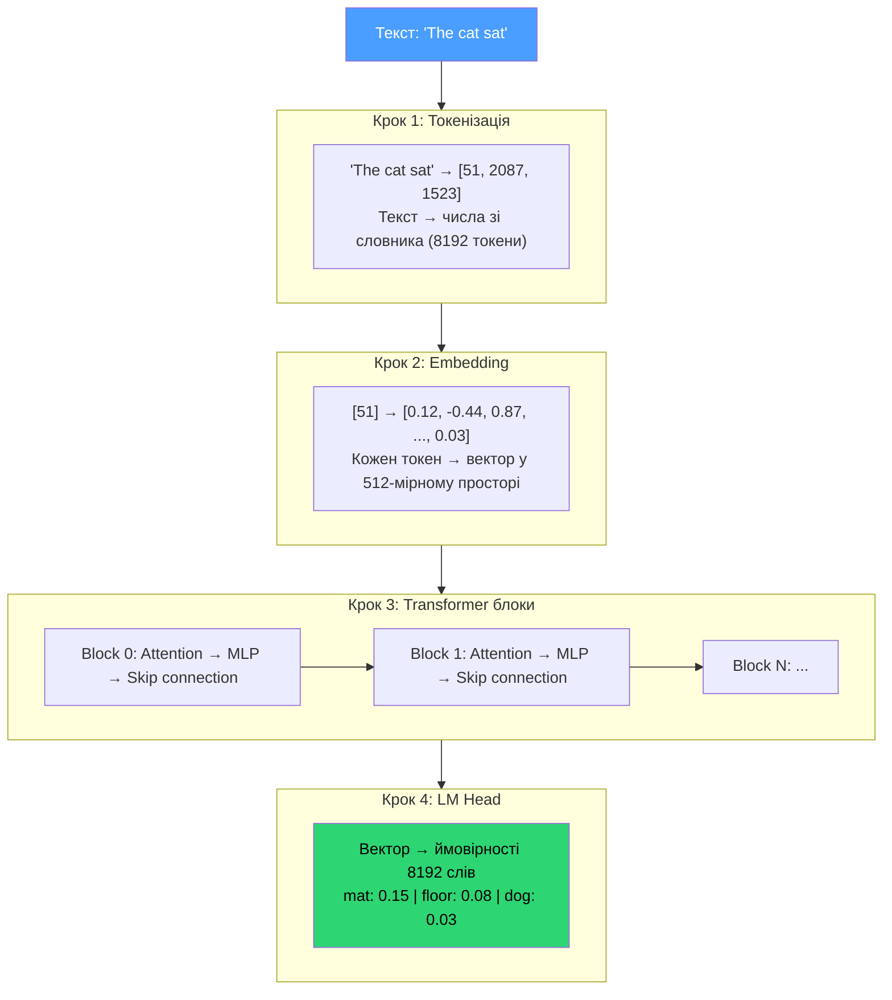
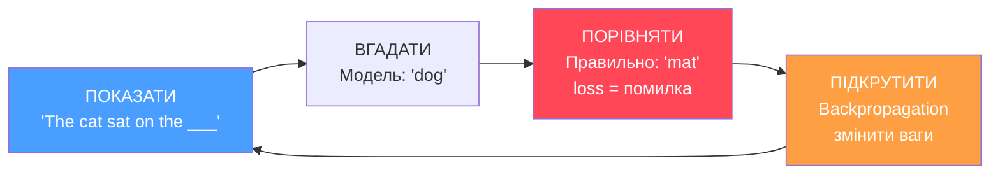
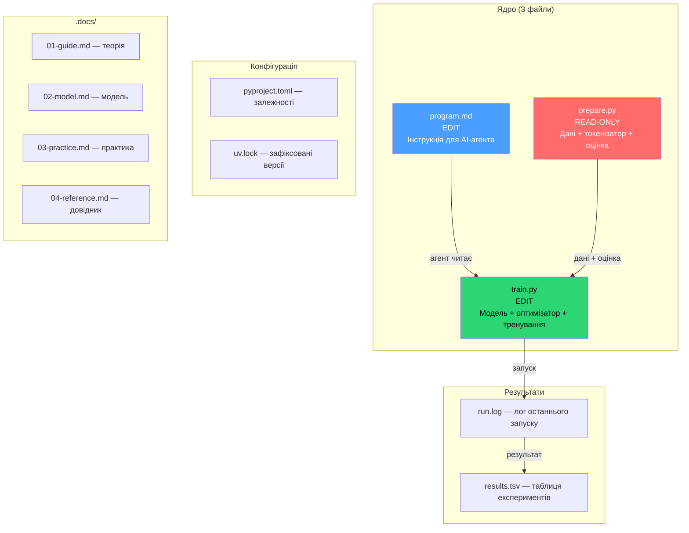
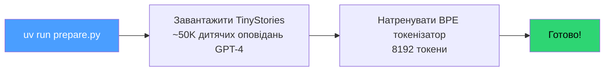

# 01 — Autoresearch: Теорія та структура

> Версія: 3.0 | Гілка: `autoresearch/mar12-depth-width`
> GPU: RTX 4070 Ti SUPER (16 GB) | Платформа: Windows + WSL

---

## Навігація

| Файл | Що всередині |
|------|--------------|
| **[[01-guide]]** (цей файл) | Що це, як працює, структура проєкту |
| [[02-model]] | Deep-dive: модель, оптимізатор, тренувальний цикл |
| [[03-practice]] | Гіперпараметри, запуск, логи, автономний режим, git |
| [[04-reference]] | FAQ, дорожня карта, глосарій |

---

## 1. Що це за проєкт

### 1.1. Одним реченням

**autoresearch** — платформа де AI-агент самостійно проводить ML-експерименти на твоєму комп'ютері, поки ти спиш.

### 1.2. Хто створив

Оригінал — [karpathy/autoresearch](https://github.com/karpathy/autoresearch), автор Андрій Карпаті (ex-Tesla AI Director, ex-OpenAI). Наш форк (`autoresearch-win-rtx`) адаптований під **Windows + споживчі GPU** (RTX серія).

### 1.3. Що конкретно відбувається



За одну ніч (~8 годин) агент проводить **~100 експериментів** повністю автономно.

### 1.4. Що ми тренуємо

Мініатюрну версію **GPT** (та сама архітектура що в ChatGPT/Claude), на датасеті коротких дитячих оповідань (**TinyStories**). Це не іграшка — архітектура справжня, просто маленька. Розмір моделі змінюється від експерименту до експерименту (18M–87M параметрів).

---

## 2. Аналогія: фабрика текстів

> Цей розділ для тих, хто ніколи не працював з нейромережами.
> Якщо вже розумієш основи — переходь до [[#3. Як працює нейромережа|розділу 3]].



| Поняття | Аналогія |
|---------|----------|
| **Текст** | Сировина що заходить на фабрику |
| **Токенізатор** | Працівник на прохідній — розрізає текст на шматочки (токени) |
| **Embedding** | Перекладач — перетворює слова на числа (вектори) |
| **Transformer-блоки** | Станції конвеєра |
| **Attention** | Начальник зміни — вирішує на що звернути увагу |
| **MLP** | Робітник — обробляє кожен шматочок окремо |
| **LM Head** | Контролер якості — обирає найімовірніше наступне слово |
| **Training** | Калібрування фабрики — показуємо правильні відповіді |
| **val_bpb** | Оцінка контролера якості (менше = точніше) |

---

## 3. Як працює нейромережа

### 3.1. Головна ідея — передбачення наступного слова

Всі сучасні мовні моделі (ChatGPT, Claude, Copilot) побудовані на одному принципі:

> Вхід: `"The cat sat on the"` → Модель: `"mat"` (найімовірніше наступне слово)

Модель бачить послідовність слів і намагається вгадати наступне.
Повторюючи це **мільйони** разів на **мільйонах** текстів — вона "вчиться" мові.

### 3.2. Шлях тексту через модель



### 3.3. Що таке Attention

**Задача**: Речення `"The cat sat on the ___"`. Яке наступне слово?

**Без Attention**: модель бачить кожне слово окремо, не розуміє зв'язків.

**З Attention**: модель "зважує" важливість кожного попереднього слова:

| Слово | `"The"` | `"cat"` | `"sat"` | `"on"` | `"the"` |
|-------|---------|---------|---------|--------|---------|
| Вага | 0.02 | **0.45** | 0.25 | **0.23** | 0.05 |
| Роль | мало важливе | **ХТО?** | ДІЯ | **ДЕ?** | мало важливе |

Результат: `"mat"` — кішки зазвичай сидять на килимках.

**Multi-Head Attention**: у моделі не одна "голова уваги", а декілька. Кожна голова шукає різні типи зв'язків: одна — граматику, інша — семантику, третя — позицію.

### 3.4. Як модель вчиться (цикл тренування)



За 5 хвилин це відбувається **сотні разів** (кількість кроків залежить від конфігурації).

**Динаміка loss** (помилки) під час тренування:
- Початок: **~6.0** (модель вгадує випадково, як кубик)
- Кінець: **~2.5** (модель вже розуміє структуру мови)

### 3.5. Метрика якості — val_bpb

**val_bpb** = **V**alidation **B**its **P**er **B**yte

Означає: скільки біт інформації потрібно моделі, щоб закодувати 1 байт тексту.

| val_bpb | Що це означає | Аналогія |
|---------|---------------|----------|
| ~4-5 | Випадкове вгадування | Мавпа стукає по клавіатурі |
| ~1.0 | Модель щось розуміє | Студент-першокурсник |
| ~0.8 | Непогано для маленької моделі | Студент-відмінник |
| ~0.5 | Дуже добре | Досвідчений письменник |
| 0 | Ідеальне передбачення | Неможливо на реальних даних |

**Чим менше — тим краще.**

**Чому bpb, а не просто loss?** Loss залежить від розміру словника: якщо змінити кількість токенів з 8192 на 4096, loss зміниться. BPB нормалізований по байтах тексту, тому порівняння завжди чесне.

---

## 4. Структура проєкту



### Золоте правило

> **Змінюємо ТІЛЬКИ `train.py`** (для експериментів) та **`program.md`** (для налаштування агента).
> Все інше — read-only.

---

## 5. prepare.py — лаборант

Цей файл — "інфраструктура". Запускається **один раз** перед першим експериментом: `uv run prepare.py`. Після цього працює тихо на фоні, поставляючи дані і оцінку для `train.py`.

### 5.1. Що він робить



Кеш зберігається:
- **Windows**: `%LOCALAPPDATA%\autoresearch\datasets\tinystories\`
- **WSL/Linux**: `~/.cache/autoresearch/datasets/tinystories/`

### 5.2. Фіксовані константи

Ці значення **зашиті** в `prepare.py` і НЕ змінюються:

```python
MAX_SEQ_LEN = 2048     # Контекст: скільки токенів модель бачить одночасно
TIME_BUDGET = 300      # Бюджет тренування: рівно 5 хвилин (300 секунд)
EVAL_TOKENS = 20.9M    # Скільки токенів для оцінки якості
VOCAB_SIZE = 8192      # Розмір словника токенізатора
```

### 5.3. Функція оцінки — evaluate_bpb()

Це "суддя" проєкту. Після 5 хвилин тренування:
1. Бере модель
2. Прогоняє через валідаційні тексти (яких модель не бачила під час тренування)
3. Рахує **bits per byte** — наскільки добре модель передбачає текст
4. Повертає число — це і є `val_bpb`

### 5.4. Dataloader — подача даних

- Кожна порція починається з **BOS** (Beginning Of Sequence)
- Документи пакуються без пустих місць (**100% утилізація**)
- Використовує **best-fit** алгоритм для щільного пакування

---

> **Далі**: [[02-model|train.py — серце експерименту]] (deep-dive в модель, оптимізатор, тренувальний цикл)
