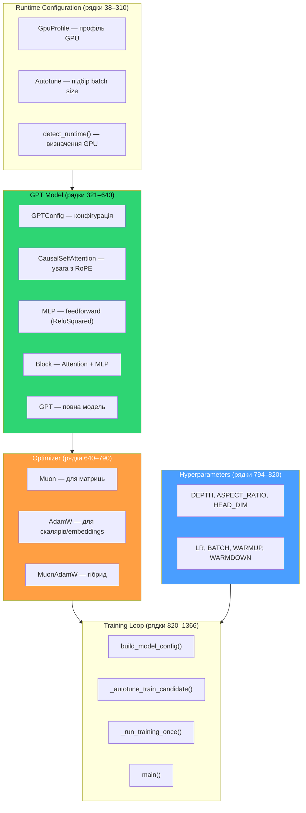
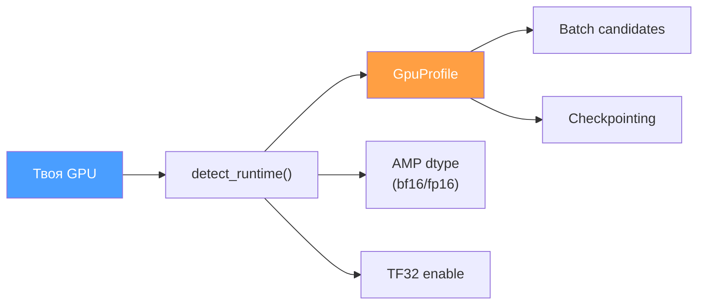
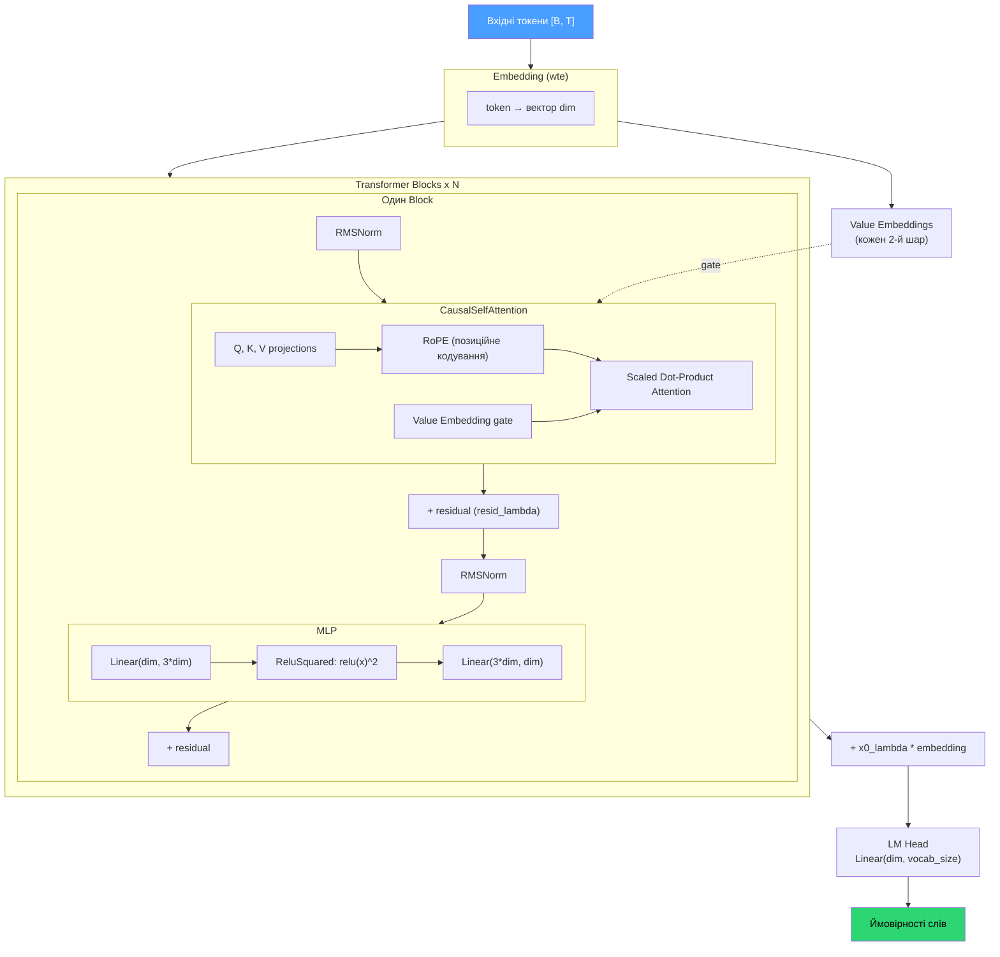
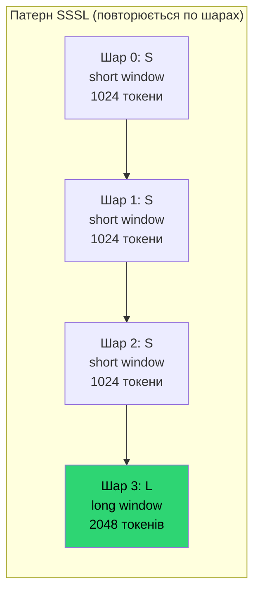
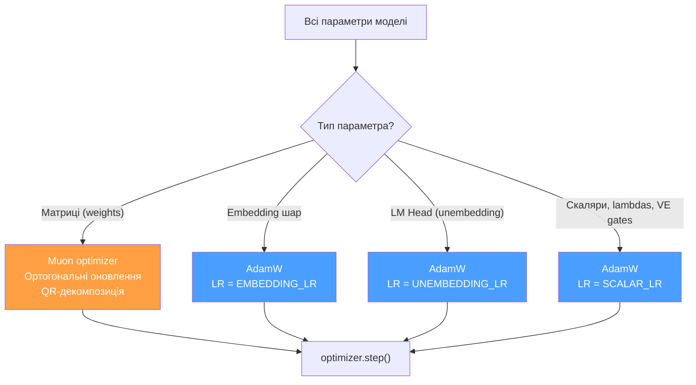
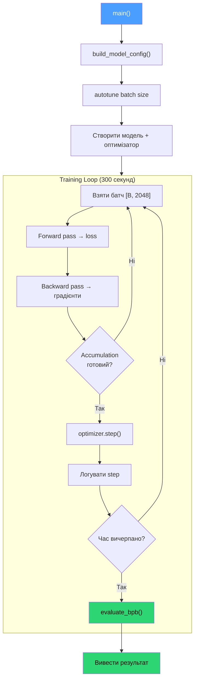

# 02 — train.py: Серце експерименту

> [[01-guide|Назад до теорії]] | [[03-practice|Далі: практика]]

---

## 6. train.py — серце експерименту

Файл ~1366 рядків. Це **єдиний файл** який змінюється під час експериментів.

### 6.1. Загальна архітектура файлу



### 6.2. Runtime Configuration

Автоматично визначає GPU і налаштовує параметри:



**GPU Profiles** — передналаштовані конфігурації:

| Профіль | GPU | VRAM | Batch candidates |
|---------|-----|------|------------------|
| `turing-8-11gb` | RTX 2060/2070 | 8–11 GB | `[8, 4, 2, 1]` |
| `turing-12-15gb` | RTX 2080 Ti | 11–15 GB | `[16, 8, 4]` |
| `ampere-10-15gb` | RTX 3060/3080 | 10–15 GB | `[16, 8, 4]` |
| `ada-10-15gb` | RTX 4070/4070TiS | 10–15 GB | `[16, 8, 4]` |
| `ada-16gb` | RTX 4080 | 16 GB | `[32, 16, 8, 4]` |
| `ada-24gb-plus` | RTX 4090 | 24+ GB | `[64, 32, 16, 8, 4]` |

**Autotune**: при першому запуску пробує різні batch size і обирає найшвидший. Результат кешується в `~/.cache/autoresearch/autotune_cache.json`.

### 6.3. Модель — GPT

```python
@dataclass
class GPTConfig:
    sequence_len: int = 2048   # Довжина контексту
    vocab_size: int = 8192     # Розмір словника (з prepare.py)
    n_layer: int = 12          # Кількість transformer шарів
    n_head: int = 6            # Кількість "голів" уваги
    n_kv_head: int = 6         # KV-голови (GQA)
    n_embd: int = 768          # Розмір embedding вектора
    window_pattern: str = "SSSL"
```

> Ці дефолти перевизначаються через `build_model_config()` на основі `DEPTH` та `ASPECT_RATIO`.

### 6.4. Компоненти моделі



Ключові архітектурні деталі:

- **RMSNorm** — нормалізація замість LayerNorm (простіша, без bias)
- **RoPE** — Rotary Positional Embeddings (кодує позицію токена в реченні)
- **GQA** — Grouped Query Attention: кількість KV-голів може бути меншою за Q-голови
- **Value Embeddings** — додаткові learnable вектори в кожному 2-му шарі, з gated додаванням
- **Residual lambdas** — learnable масштаб skip-connection для кожного шару
- **x0 connection** — додає масштабований embedding до виходу (shortcut через усі блоки)
- **ReluSquared** — `relu(x)^2` замість GELU (простіше, часто краще для малих моделей)

### 6.5. Sliding Window Attention

Патерн `SSSL` означає:



Short-шари швидші (менше обчислень), long-шар бачить повний контекст.

### 6.6. Оптимізатор — MuonAdamW

Гібридний оптимізатор з окремим підходом для різних типів параметрів:



| Тип параметра | Оптимізатор | LR | Чому |
|---------------|-------------|-----|------|
| Матриці (weights) | **Muon** | `MATRIX_LR` (0.12) | Ортогональні оновлення — зберігає геометрію |
| Embedding | **AdamW** | `EMBEDDING_LR` (1.2) | Великий LR для швидкої адаптації embedding |
| Unembedding (LM Head) | **AdamW** | `UNEMBEDDING_LR` (0.008) | Маленький LR для стабільності виходу |
| Скаляри, lambdas | **AdamW** | `SCALAR_LR` (0.5) | Стандартний |

### 6.7. Training Loop



**Gradient Accumulation**: `TOTAL_BATCH_SIZE / (DEVICE_BATCH_SIZE * MAX_SEQ_LEN)` міні-батчів збираються перед одним кроком оптимізатора. Це дозволяє симулювати великий batch size на GPU з малим VRAM.

### 6.8. Формула розміру моделі

```python
base_dim = DEPTH * ASPECT_RATIO
model_dim = ceil(base_dim / HEAD_DIM) * HEAD_DIM  # вирівнювання по HEAD_DIM
num_heads = model_dim // HEAD_DIM
```

Приклади:

| DEPTH | AR | base_dim | model_dim | heads | ~params |
|-------|-----|----------|-----------|-------|---------|
| 2 | 256 | 512 | 512 | 4 | 18.9M |
| 3 | 171 | 513 | 640 | 5 | 33.3M |
| 4 | 128 | 512 | 512 | 4 | 29.4M |
| 6 | 128 | 768 | 768 | 6 | 66.8M |
| 8 | 64 | 512 | 512 | 4 | 50.3M |

---

> **Далі**: [[03-practice|Практика: гіперпараметри, запуск, логи, автономний режим]]
