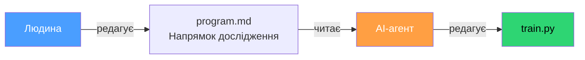
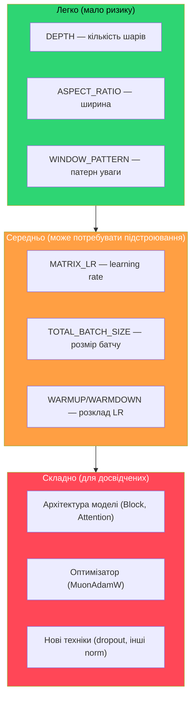
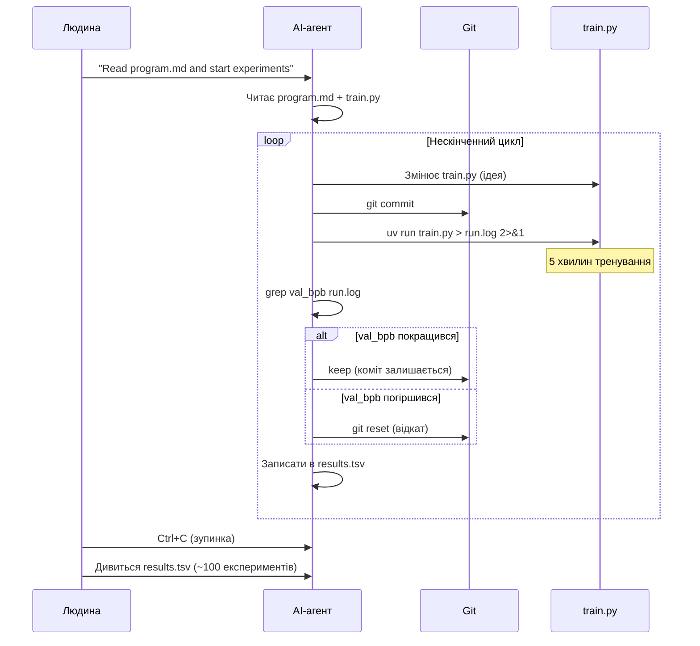

# 03 — Практика: запуск, логи, автономний режим

> [[02-model|Назад до моделі]] | [[04-reference|Далі: довідник]]

---

## 7. program.md — інструкція для AI-агента

Цей файл — "програма" для AI-агента (Claude, Codex, тощо). Він описує:
- Як налаштувати середовище (setup)
- Що можна і що не можна змінювати
- Як запускати експерименти
- Як логувати результати
- Правило: **НІКОЛИ НЕ ЗУПИНЯТИСЬ** — агент працює автономно поки його не зупинять



---

## 8. Гіперпараметри — що крутити і навіщо

### 8.1. Архітектура моделі

| Параметр | Поточне | Рядок | Що робить |
|----------|---------|-------|-----------|
| `DEPTH` | 4 | `train.py:816` | Кількість transformer шарів |
| `ASPECT_RATIO` | 128 | `train.py:799` | `model_dim = DEPTH * AR` (ширина моделі) |
| `HEAD_DIM` | 128 | `train.py:800` | Розмір однієї "голови" уваги |
| `WINDOW_PATTERN` | `"SSSL"` | `train.py:801` | Патерн sliding window attention |

### 8.2. Оптимізація (learning rates)

| Параметр | Поточне | Що робить |
|----------|---------|-----------|
| `EMBEDDING_LR` | 1.2 | Швидкість навчання embedding шару |
| `UNEMBEDDING_LR` | 0.008 | Швидкість навчання LM Head |
| `MATRIX_LR` | 0.12 | Швидкість навчання основних ваг (Muon) |
| `SCALAR_LR` | 0.5 | Швидкість навчання скалярних параметрів |
| `WEIGHT_DECAY` | 0.2 | Регуляризація |
| `ADAM_BETAS` | (0.8, 0.95) | Momentum параметри Adam |

### 8.3. Батч і розклад

| Параметр | Поточне | Що робить |
|----------|---------|-----------|
| `TOTAL_BATCH_SIZE` | 2^17 (131K) | Токенів на один крок оптимізації |
| `DEVICE_BATCH_SIZE` | 16 | Зразків за один forward pass |
| `WARMUP_RATIO` | 0.0 | Розігрів LR на початку |
| `WARMDOWN_RATIO` | 0.7 | Частка тренування з зниженням LR |
| `FINAL_LR_FRAC` | 0.0 | Фінальний LR (частка від початкового) |

### 8.4. Рівні складності змін



---

## 9. Практика: запуск експериментів

### 9.1. Одноразовий запуск

```bash
# Повний запуск (5 хвилин тренування + ~1 хв eval)
uv run train.py

# Швидкий тест (перевірити що не падає)
uv run train.py --smoke-test
```

### 9.2. Запуск з логуванням

```bash
# Перенаправити вивід у файл
uv run train.py > run.log 2>&1

# Спостерігати в реальному часі (в іншому терміналі)
# PowerShell:
Get-Content -Path "run.log" -Wait -Tail 20
# WSL/Linux:
tail -f run.log
```

### 9.3. Дістати результати з логу

```bash
# Головна метрика
grep "^val_bpb:" run.log

# Використання VRAM
grep "^peak_vram_mb:" run.log

# Все одразу
grep "^val_bpb:\|^peak_vram_mb:\|^mfu_percent:\|^num_steps:\|^num_params_M:" run.log
```

### 9.4. Змінні середовища

```bash
# Вимкнути autotune
export AUTORESEARCH_DISABLE_AUTOTUNE=1

# Перезапустити autotune
export AUTORESEARCH_AUTOTUNE_REFRESH=1

# Примусово увімкнути/вимкнути activation checkpointing
export AUTORESEARCH_FORCE_CHECKPOINTING=1  # або 0
```

---

## 10. Як читати логи

### 10.1. Лог тренування (step by step)

```
step 00032 (55.2%) | loss: 3.125 | lrm: 0.45 | dt: 6500ms | tok/sec: 80600 | mfu: 10.9% | epoch: 1 | remaining: 135s
```

| Поле | Що означає |
|------|-----------|
| `step 00032` | Номер кроку оптимізації |
| `(55.2%)` | Прогрес за часом (% від 5 хвилин) |
| `loss: 3.125` | Помилка моделі (менше = краще) |
| `lrm: 0.45` | Множник learning rate (1.0 → 0.0) |
| `dt: 6500ms` | Час одного кроку (мілісекунди) |
| `tok/sec: 80600` | Токенів за секунду (throughput) |
| `mfu: 10.9%` | Model FLOPs Utilization |
| `epoch: 1` | Прохід по датасету |
| `remaining: 135s` | Секунд до кінця |

### 10.2. Фінальний звіт

```
---
val_bpb:          0.496263    ← ГОЛОВНА МЕТРИКА (менше = краще)
training_seconds: 300.8       ← Час тренування (завжди ~300с)
total_seconds:    380.2       ← Загальний час (з eval)
peak_vram_mb:     2660.0      ← Пікове використання VRAM
mfu_percent:      11.10       ← Ефективність GPU
total_tokens_M:   29.9        ← Мільйони токенів
num_steps:        534         ← Кроків оптимізації
num_params_M:     33.3        ← Мільйони параметрів
depth:            3           ← Кількість шарів
```

### 10.3. Що нормально, а що ні

| Показник | Нормально | Проблема |
|----------|-----------|----------|
| loss | Стабільно падає 5.x → 2.x | Зростає або "стрибає" > 100 |
| val_bpb | 0.4 – 1.2 | > 2.0 (модель не вчиться) |
| peak_vram_mb | < 14000 (з 16 GB) | > 15000 (ризик OOM) |
| tok/sec | > 50000 | < 10000 (щось гальмує) |
| mfu | 8–15% | < 3% (неефективно) |

---

## 11. Автономний режим (AI-агент)

### 11.1. Як це працює



### 11.2. Як запустити агента

```bash
# З WSL (автономний режим без підтверджень)
claude --dangerously-skip-permissions -p "Read program.md and start the experiment loop. The branch is autoresearch/<tag>, continue from the current state."
```

### 11.3. Як зупинити

Просто закрити термінал або натиснути `Ctrl+C`. Результати вже збережені в `results.tsv` і git.

---

## 12. Git-воркфлоу

### 12.1. Структура гілок

```mermaid
gitgraph
    commit id: "master"
    branch autoresearch/mar12-depth-width
    commit id: "baseline"
    commit id: "exp1: DEPTH=4 (keep)"
    commit id: "exp3: DEPTH=2 (keep)"
    commit id: "exp5: LR=0.08 (keep)"
    commit id: "exp19: DEPTH=3 (keep)"
```

### 12.2. Правила

- Кожен експеримент = окрема гілка від master
- Кожна зміна `train.py` = окремий коміт
- Якщо val_bpb покращився → **keep** (коміт залишається)
- Якщо val_bpb погіршився → **discard** (`git reset` до попереднього коміту)
- Результати записуються в `results.tsv` (TSV = tab-separated)

### 12.3. Ручний воркфлоу

```bash
# 1. Створити гілку
git checkout -b autoresearch/mar13-my-experiment

# 2. Змінити train.py
# ... редагувати файл ...

# 3. Закомітити
git add train.py
git commit -m "exp: try DEPTH=12"

# 4. Запустити
uv run train.py > run.log 2>&1

# 5. Перевірити результат
grep "^val_bpb:" run.log

# 6a. Якщо краще — записати і продовжити
# 6b. Якщо гірше — відкотити
git reset --hard HEAD~1
```

---

## 13. Каталог типових експериментів

### Експеримент A: Глибина vs Ширина

```python
# Shallow-wide (менше шарів, ширший dim)
DEPTH = 2;  ASPECT_RATIO = 256   # dim=512, 18.9M

# Balanced
DEPTH = 4;  ASPECT_RATIO = 128   # dim=512, 29.4M

# Deep-narrow (більше шарів, вужчий dim)
DEPTH = 8;  ASPECT_RATIO = 64    # dim=512, 50.3M
```

### Експеримент B: Window Pattern

```python
WINDOW_PATTERN = "L"      # Всі шари — повний контекст
WINDOW_PATTERN = "SL"     # Чергування
WINDOW_PATTERN = "SSSL"   # Поточний (3 short + 1 long)
WINDOW_PATTERN = "LLLL"   # Всі long
```

### Експеримент C: Learning Rate

```python
MATRIX_LR = 0.04   # Консервативний
MATRIX_LR = 0.08   # Помірний
MATRIX_LR = 0.12   # Поточний (sweet spot)
MATRIX_LR = 0.16   # Агресивний (може розійтись)
```

### Експеримент D: Batch Size

```python
TOTAL_BATCH_SIZE = 2 ** 16   # 65K — маленький, багато кроків
TOTAL_BATCH_SIZE = 2 ** 17   # 131K — поточний
TOTAL_BATCH_SIZE = 2 ** 18   # 262K — великий
TOTAL_BATCH_SIZE = 2 ** 19   # 524K — дуже великий, мало кроків
```

---

> **Далі**: [[04-reference|FAQ, дорожня карта, глосарій]]
