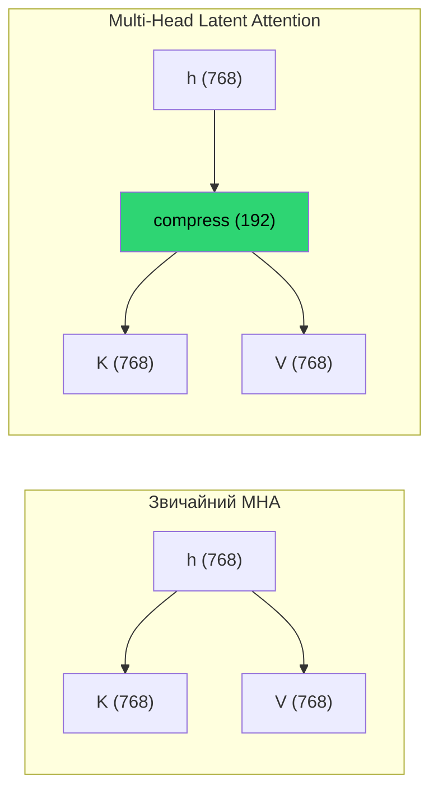
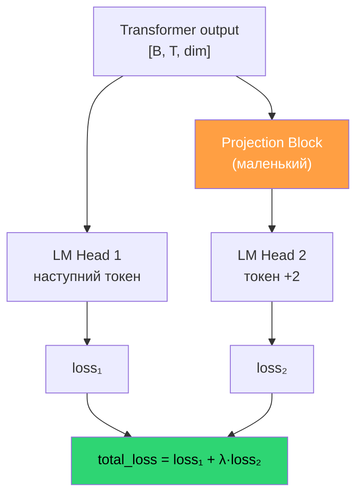
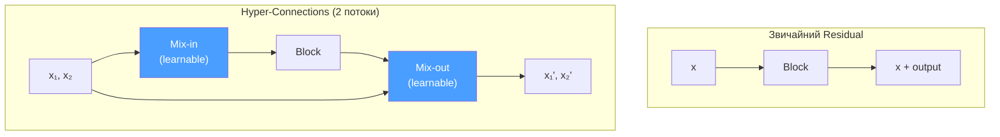
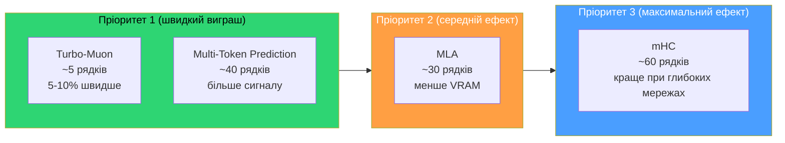

# 05 — Техніки DeepSeek для покращення трансформера

> Джерела: DeepSeek-V2, DeepSeek-V3, mHC paper, Muon optimizer
> Контекст: що з цього можна реалізувати в `train.py` для нашої маленької GPT

---

## 1. Multi-Head Latent Attention (MLA)

### Проблема
Звичайний Multi-Head Attention зберігає повні K,V вектори для кожної голови.
При `dim=768, n_head=6` це 768+768 = 1536 чисел на токен на кеш.

### Рішення DeepSeek
Стиснути K,V через **low-rank bottleneck**:



```python
# Було (стандартний attention):
K = W_k(h)       # [768] → [768]
V = W_v(h)       # [768] → [768]
# Кеш: 768 + 768 = 1536 на токен

# Стало (MLA):
latent = W_down(h)   # [768] → [192]  (стиснення)
K = W_up_k(latent)   # [192] → [768]  (розтиснення)
V = W_up_v(latent)   # [192] → [768]
# Кеш: тільки 192 на токен (8x менше!)
```

### Чому це краще за GQA
- **GQA** (Grouped Query Attention): кілька Q-голів ділять одну K,V голову → втрата якості
- **MLA**: всі голови мають свої K,V, але вони реконструюються з спільного latent → без втрати якості

### Що дає нам
- Менше пам'яті → можна збільшити модель або batch size
- Менше обчислень на attention → швидші кроки
- Реалізація: ~30 рядків в `CausalSelfAttention`

### Реалізація для train.py

```python
class CausalSelfAttention(nn.Module):
    def __init__(self, config, layer_idx):
        super().__init__()
        # ... існуючий код ...

        # MLA: low-rank compression
        self.kv_latent_dim = config.n_embd // 4  # compression ratio 4x
        self.c_kv_down = nn.Linear(config.n_embd, self.kv_latent_dim, bias=False)
        self.c_k_up = nn.Linear(self.kv_latent_dim, self.n_kv_head * self.head_dim, bias=False)
        self.c_v_up = nn.Linear(self.kv_latent_dim, self.n_kv_head * self.head_dim, bias=False)
        # Видалити старі c_k, c_v

    def forward(self, x, ...):
        kv_latent = self.c_kv_down(x)       # [B, T, latent_dim]
        k = self.c_k_up(kv_latent)           # [B, T, kv_dim]
        v = self.c_v_up(kv_latent)           # [B, T, kv_dim]
        # ... решта як раніше ...
```

---

## 2. Multi-Token Prediction (MTP)

### Проблема
Модель передбачає лише 1 наступний токен → за 5 хвилин отримуємо обмежений навчальний сигнал.

### Рішення DeepSeek
Передбачати **2+ токени наперед**, кожен через свій маленький projection head:



```python
# Додатковий prediction head
class NextTokenHead(nn.Module):
    def __init__(self, dim, vocab_size):
        super().__init__()
        self.proj = nn.Linear(dim, dim, bias=False)
        self.head = nn.Linear(dim, vocab_size, bias=False)

    def forward(self, x):
        return self.head(F.relu(self.proj(x)))

# В GPT.forward():
logits_1 = self.lm_head(x)                    # наступний токен
logits_2 = self.next_token_head(x[:, :-1, :]) # токен +2 vs targets[:, 1:]
loss = loss_1 + 0.3 * loss_2                   # λ = 0.3 (DeepSeek default)
```

### Що дає нам
- **Більше навчального сигналу** за ті ж 5 хвилин
- Модель вчиться "планувати наперед" — краща якість
- ~5-10% overhead на forward pass
- DeepSeek каже: 85-90% accuracy на другому токені

---

## 3. Manifold-Constrained Hyper-Connections (mHC)

### Проблема
Звичайний residual `x = x + block(x)` може підсилювати шум в глибоких мережах.
DeepSeek виявив: в 27B моделі residual amplification доходить до **3000x** → тренування розходиться.

### Рішення
Замість одного потоку — кілька паралельних "потоків" з learnable mixing:



### Результати DeepSeek
- **-0.021 loss** на 27B моделі
- Всі 8 бенчмарків покращились (BBH: 43.8 → 51.0, DROP: 47.0 → 53.9)
- Overhead: лише **6.7%** часу тренування
- Стабільніше тренування (без loss spikes)

### Що дає нам
- У нас вже є `resid_lambdas` + `x0_lambdas` — спрощена версія
- Повна mHC дасть більший ефект при DEPTH >= 4
- Складніша реалізація (~60 рядків)

---

## 4. Покращення Muon оптимізатора

### Turbo-Muon
Зменшити кількість Newton-Schulz ітерацій з 5 до 4 через AOL preconditioning:
- ~20% швидша ортогоналізація
- Мінімальні зміни в коді (~5 рядків)

### AdaMuon
Комбінує ортогональні оновлення Muon з element-wise adaptivity (як Adam):
- **+40% ефективність** в large-scale
- Зберігає переваги обох оптимізаторів

### Поточний Muon в нашому коді
```python
# train.py, функція muon_step_fused()
# Використовує 5 Newton-Schulz ітерацій для ортогоналізації
# Можна спробувати зменшити до 4
```

---

## 5. Пріоритети реалізації



| Техніка | Складність | Ефект | Рядків | Ризик |
|---------|-----------|-------|--------|-------|
| Turbo-Muon (4 NS ітерації) | Легка | 5-10% швидше | ~5 | Низький |
| Multi-Token Prediction | Середня | Більше навчання за ті ж 5 хв | ~40 | Середній |
| MLA (low-rank KV) | Середня | Менше VRAM → більша модель | ~30 | Середній |
| mHC (2 потоки) | Висока | Краща якість + стабільність | ~60 | Високий |

---

## Джерела

- [DeepSeek-V3 Technical Report (arxiv)](https://arxiv.org/abs/2412.19437)
- [How has DeepSeek improved the Transformer architecture? (Epoch AI)](https://epoch.ai/gradient-updates/how-has-deepseek-improved-the-transformer-architecture)
- [DeepSeek mHC paper (SuperGok)](https://supergok.com/deepseek-mhc-transformer-architecture/)
- [Hyper-Connections explained (Medium)](https://medium.com/@yugank.aman/beyond-residuals-deepseeks-hyper-connections-and-the-next-phase-of-transformer-design-43390009a805)
- [Muon optimizer (GitHub)](https://github.com/KellerJordan/Muon)
- [Muon is Scalable for LLM Training (arxiv)](https://arxiv.org/html/2502.16982v1)
- [AdaMuon (OpenReview)](https://openreview.net/forum?id=OpxVAHFmkL)
