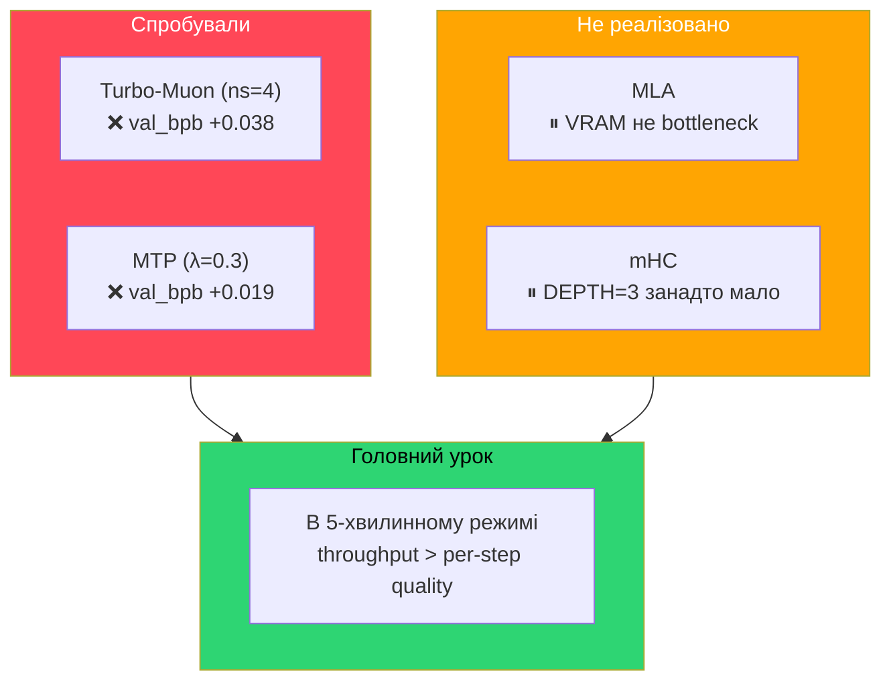

# 06 — Результати впровадження технік DeepSeek

> Що обіцяли статті vs що вийшло на практиці з нашою 28-33M GPT на RTX 4070 Ti SUPER

---

## Контекст

Наш проєкт має жорстке обмеження: **5 хвилин тренування**. Це означає, що будь-яка техніка, яка сповільнює один крок (навіть якщо покращує якість per-step), може дати гірший результат через менше загальних кроків.

**Baseline для порівняння**: exp19, val_bpb **0.496263**, DEPTH=3, AR=171, dim=512, 33.3M params, 534 кроки.

---

## P0: Turbo-Muon (ns_steps 5 → 4)

### Що обіцяли
- Newton-Schulz ітерації 5 → 4 через AOL preconditioning
- ~20% швидша ортогоналізація Muon
- Мінімальний вплив на якість

### Що вийшло

| Метрика | Baseline (ns=5) | Turbo-Muon (ns=4) | Різниця |
|---------|-----------------|-------------------|---------|
| val_bpb | 0.496 | 0.534 | **+0.038 (гірше)** |
| кроків | 534 | ~540 | +1% |
| tok/sec | ~136K | ~138K | +1.5% |

### Висновок
**Reverted.** Прискорення на 1.5% tok/sec не компенсує втрату якості ортогоналізації. В оригінальному Muon 5 ітерацій — це sweet spot для маленьких моделей. AOL preconditioning працює на scale (>1B params), де ортогоналізація займає більшу частку часу.

### Чому статті не мали рації для нас
- DeepSeek тестували на моделях >7B, де NS ітерація коштує значно більше
- У нашій 33M моделі NS — малий % від загального compute
- 4 ітерації дають менш точну ортогональну проекцію → градієнти менш ефективні

---

## P1: Multi-Token Prediction (MTP)

### Що обіцяли
- Передбачення token+2 через додатковий head
- Більше навчального сигналу за той же час
- ~5-10% overhead на forward pass
- DeepSeek: 85-90% accuracy на другому токені

### Що вийшло

| Метрика | Baseline | MTP (λ=0.3) | Різниця |
|---------|----------|-------------|---------|
| val_bpb | 0.496 | 0.515 | **+0.019 (гірше)** |
| params | 33.3M | 28.0M | -5.3M (інша конфігурація) |
| кроків | 534 | 296 | **-45%** |
| tok/sec | ~136K | ~137K | +0.7% |
| VRAM | 2.6 GB | 3.7 GB | +1.1 GB |

### Висновок
**Не покращило.** Головна причина — **вдвічі менше кроків**. MTP head додав обчислення на forward/backward, але не прискорив convergence достатньо щоб компенсувати.

### Чому статті не мали рації для нас
- DeepSeek тренує мільйони кроків — MTP amortizується over time
- У нас ~300-530 кроків — недостатньо щоб MTP сигнал дав ефект
- Наш MTP — спрощений (один nn.Linear без projection block), але навіть повний варіант додав би ще більше overhead
- **Ключовий інсайт**: в time-limited режимі throughput (кроків/хвилину) важливіший за per-step learning signal

---

## P2: MLA (Multi-Head Latent Attention) — не реалізовано

### Що обіцяють
- Low-rank compression для K,V: dim → dim/4 → dim
- 4-8x менший KV-cache
- Менше VRAM на attention

### Прогноз для нашого проєкту
- Ми використовуємо лише **2.6-3.7 GB з 16 GB** VRAM — економія пам'яті нерелевантна
- MLA додає 2 додаткові matmul на layer (down + up projection) — може сповільнити кроки
- Потенційно корисно лише якщо ми суттєво збільшимо модель і впремось в VRAM

### Статус
**Backlog.** Не має сенсу поки не використовуємо хоча б 80% VRAM.

---

## P3: mHC (Manifold-Constrained Hyper-Connections) — не реалізовано

### Що обіцяють
- Multiple residual streams з learnable mixing
- -0.021 loss на 27B моделі DeepSeek
- Стабільніше тренування (без loss spikes)
- 6.7% overhead

### Прогноз для нашого проєкту
- У нас вже є `resid_lambdas` + `x0_lambdas` — спрощена версія hyper-connections
- mHC найбільш ефективна при DEPTH ≥ 6, а наш оптимум — DEPTH=3
- Додаткові параметри + compute на mix-in/mix-out можуть з'їсти throughput

### Статус
**Backlog.** Може стати актуальним якщо знайдемо спосіб ефективно використати більшу глибину.

---

## Загальні висновки

### Чому техніки DeepSeek не працюють для нас

1. **Масштаб**: DeepSeek оптимізує для моделей 7B-671B. Наша модель 28-33M — в 200-20000x менша. Overhead від додаткових компонентів відносно більший.

2. **Time-limited тренування**: 5 хвилин = 300-530 кроків. В DeepSeek тренують мільйони кроків. Техніки що покращують per-step learning (MTP) не amortizуються за 300 кроків.

3. **VRAM не bottleneck**: Ми використовуємо 2.6 GB з 16 GB. Техніки економії пам'яті (MLA) не дають переваг.

4. **Throughput — king**: В нашому режимі кожен зайвий мілісекунд на крок = менше кроків = гірший результат. Найкращі покращення прийшли від **зменшення** моделі (MLP 3x замість 4x, DEPTH=3 замість 8).

### Що насправді працює для нашого масштабу

| Зміна | val_bpb покращення | Чому |
|-------|-------------------|------|
| DEPTH 8→2 | -0.244 | Більше кроків за 5 хв |
| Batch 2^19→2^17 | -0.011 | Більше оптимізаційних кроків |
| Matrix LR 0.04→0.12 | -0.009 | Агресивніше навчання за обмежений час |
| MLP 4x→3x | -0.007 | Швидші кроки → більше кроків |
| DEPTH 2→3 (з tuned params) | -0.009 | Sweet spot глибина/ширина |
| Embedding LR 0.6→1.2 | -0.002 | Швидша ініціалізація |

---

## Джерела

- [[05-deepseek-techniques|Дослідження технік DeepSeek]] — теорія та план
- [DeepSeek-V3 Technical Report](https://arxiv.org/abs/2412.19437)
- [Muon optimizer](https://github.com/KellerJordan/Muon)
- `results.tsv` — повна таблиця експериментів
